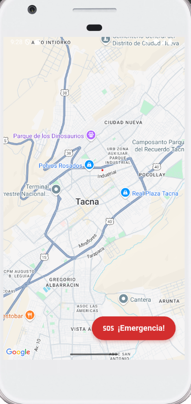
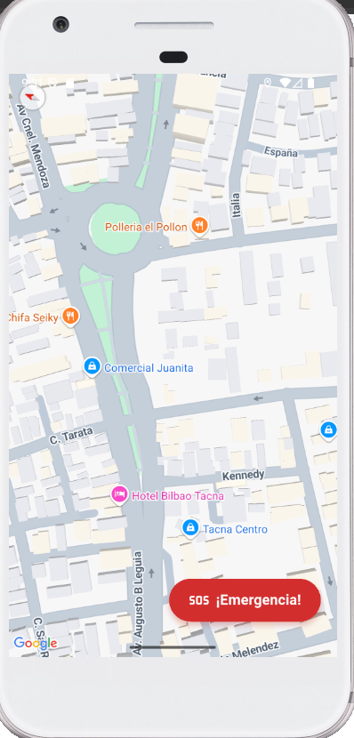
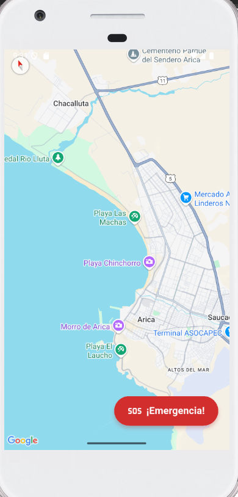
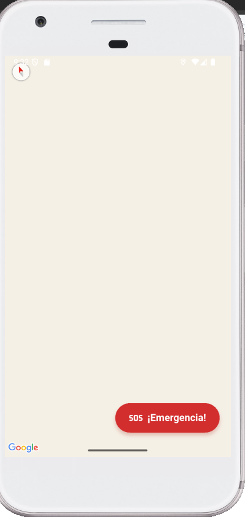
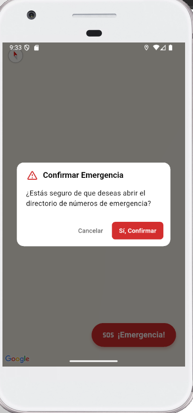
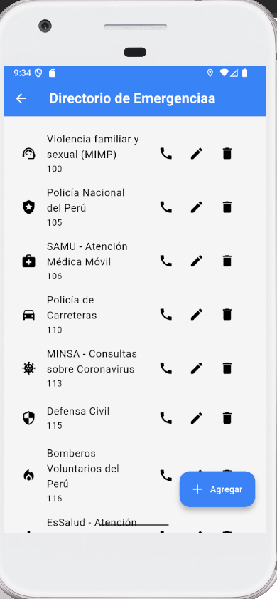
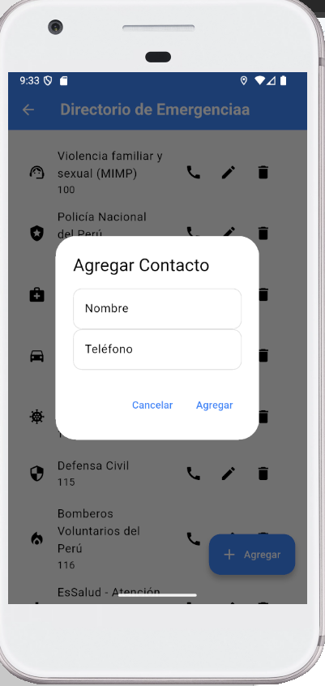

# SM2_EXAMEN_PRACTICO - Alerta Tacna (Nombre Sugerido)

<!-- Reemplaza "Alerta Tacna" con el nombre final de tu app si es diferente. -->

**URL del Repositorio Público:** `https://github.com/[TU_USUARIO_GITHUB]/SM2_EXAMEN_PRACTICO`
<!-- ¡MUY IMPORTANTE! Reemplaza [TU_USUARIO_GITHUB] con tu nombre de usuario de GitHub. -->

---

## 📜 Descripción del Proyecto

**Alerta Tacna** es una aplicación móvil en desarrollo diseñada para fortalecer la seguridad ciudadana en la ciudad de Tacna. Este proyecto se enfoca en proporcionar herramientas vitales a los usuarios, como la visualización de un mapa interactivo de la ciudad y un acceso rápido a llamadas de emergencia y gestión de contactos importantes.

### ✨ Funcionalidades Implementadas (Historias de Usuario Documentadas)

En esta entrega, se han implementado y documentado las siguientes funcionalidades esenciales:

1.  **H02: Mostrar mapa interactivo de Tacna (Versión inicial)**: Permite a los usuarios visualizar y navegar geográficamente por la ciudad de Tacna utilizando la API de Google Maps.
2.  **H11: Botón de Emergencia y configuración de contactos**: Facilita a los usuarios realizar llamadas de emergencia directas y administrar una agenda de contactos de emergencia personal.

---

## 🚀 Historias de Usuario Implementadas

A continuación, se detalla la implementación de las dos historias de usuario seleccionadas:

### Historia de Usuario 1: H02 - Mostrar mapa interactivo de Tacna (Versión inicial)

**ID de Historia:** `H02`

**Como** usuario de la aplicación,
**Quiero** visualizar un mapa interactivo centrado en la ciudad de Tacna,
**Para** poder orientarme geográficamente y explorar diferentes zonas de la ciudad.

#### Criterios de Aceptación:

*   [ ] Al abrir la pantalla correspondiente, se muestra un mapa de Google Maps.
*   [ ] El mapa se carga inicialmente centrado en una ubicación representativa de Tacna.
*   [ ] El usuario puede hacer zoom (acercar/alejar) en el mapa.
*   [ ] El usuario puede hacer pan (desplazarse) por el mapa.
*   [ ] El mapa muestra calles, puntos de interés y otros detalles geográficos proporcionados por Google Maps.

#### Descripción Detallada de la Implementación:

Esta funcionalidad se implementa utilizando el paquete `google_maps_flutter` para integrar Google Maps dentro de la aplicación Flutter. Al acceder a la vista del mapa, se inicializa el widget `GoogleMap` con una `initialCameraPosition` configurada para apuntar a las coordenadas geográficas de Tacna.

El usuario puede interactuar con el mapa mediante gestos táctiles estándar:
*   **Pellizcar para hacer zoom:** Permite acercar o alejar la vista del mapa.
*   **Arrastrar para desplazarse (pan):** Permite mover el centro visible del mapa.

La API de Google Maps se encarga de renderizar los detalles del mapa, como calles, nombres de lugares y límites geográficos, actualizándolos dinámicamente según la interacción del usuario. No se han añadido marcadores personalizados ni capas adicionales en esta versión inicial de la historia.

#### Evidencia Visual (Capturas de Pantalla):

<!-- Coloca aquí tus capturas. Asegúrate de que las imágenes estén en `assets/images/` -->

**1. Vista inicial del mapa centrado en Tacna.**

<!-- Reemplaza `HU02_MapaTacna_Inicial.png` con el nombre real de tu imagen. -->

**2. Mapa con zoom aplicado por el usuario.**



**3. Mapa desplazado a otra zona de Tacna.**


---

### Historia de Usuario 2: H11 - Botón de Emergencia y configuración de contactos

**ID de Historia:** `H11`

**Como** usuario de la aplicación,
**Quiero** tener un botón de emergencia para realizar llamadas rápidas y poder configurar una lista de contactos de emergencia personales,
**Para** poder solicitar ayuda rápidamente en caso de una emergencia y notificar a mis contactos clave.

#### Criterios de Aceptación:

*   **Botón de Emergencia:**
    *   [ ] Existe un botón claramente identificable como "Emergencia" o con un ícono universal (ej. SOS, teléfono rojo).
    *   [ ] Al pulsar el botón de emergencia, se inicia una llamada directa a un número preconfigurado (ej. 105 para la Policía Nacional del Perú).
    *   [ ] Se solicitan los permisos necesarios para realizar llamadas si aún no han sido otorgados.
*   **Configuración de Contactos de Emergencia:**
    *   [ ] El usuario puede acceder a una sección para administrar sus contactos de emergencia.
    *   [ ] El usuario puede agregar un nuevo contacto de emergencia especificando nombre y número de teléfono.
    *   [ ] Los contactos agregados se guardan (ej. en Firebase Firestore o localmente).
    *   [ ] Los contactos guardados se muestran en una lista.
    *   [ ] (Opcional) El usuario puede editar o eliminar contactos existentes.
    *   [ ] (Opcional avanzado) Al pulsar un contacto de emergencia de la lista, se inicia una llamada a ese contacto.

#### Descripción Detallada de la Implementación:

Esta funcionalidad se divide en dos componentes principales:

1.  **Botón de Emergencia:**
    Se implementa un widget `ElevatedButton` (o similar) con un texto o ícono distintivo. Al ser presionado, utiliza el paquete `url_launcher` para invocar una acción de marcado telefónico (`tel:` URI) con un número de emergencia predefinido (ej: `tel:105`). La aplicación debe tener declarado el permiso `android.permission.CALL_PHONE` en el `AndroidManifest.xml` y solicitarlo en tiempo de ejecución si es necesario.

2.  **Configuración de Contactos de Emergencia:**
    Se desarrolla una nueva pantalla o sección donde el usuario puede gestionar su lista de contactos.
    *   **Agregar Contacto:** Un formulario permite ingresar el nombre y número de teléfono del nuevo contacto. Al guardar, estos datos se almacenan, por ejemplo, en una colección de Firebase Firestore asociada al usuario (si hay autenticación) o en una lista general si no hay usuarios diferenciados aún.
    *   **Listar Contactos:** Los contactos guardados se recuperan de Firebase Firestore (o almacenamiento local) y se muestran en un `ListView`. Cada ítem de la lista muestra el nombre y número del contacto.
    *   **(Opcional) Llamar a Contacto Personal:** Similar al botón de emergencia, al tocar un contacto de la lista, se podría usar `url_launcher` para iniciar una llamada a ese número específico.

#### Evidencia Visual (Capturas de Pantalla):

<!-- Coloca aquí tus capturas. Asegúrate de que las imágenes estén en `assets/images/` -->

**1. Botón de Emergencia visible en la UI.**

<!-- Reemplaza con tus nombres de archivo y descripciones. -->

**2. (Si aplica) Diálogo de confirmación o inicio de llamada de emergencia.**


**3. Pantalla de configuración/lista de contactos de emergencia.**


**4. Formulario para agregar un nuevo contacto de emergencia.**


---

## 🛠️ Tecnologías Utilizadas

*   **Lenguaje de Programación:** Dart (Última versión estable, ej. 3.3.x o superior)
*   **Framework de Desarrollo Móvil:** Flutter (Última versión estable, ej. 3.19.x o superior)
*   **Target SDK Android:** API Nivel 35
*   **Mapas:** Google Maps Platform (a través del paquete `google_maps_flutter`)
*   **Base de Datos (para contactos):** Firebase Firestore (Cloud Firestore)
*   **Paquetes Flutter Clave:**
    *   `google_maps_flutter`: Para la integración del mapa interactivo.
    *   `url_launcher`: Para realizar llamadas telefónicas.
    *   `cloud_firestore`: Para la interacción con la base de datos Firebase Firestore.
    *   `firebase_core`: Para inicializar Firebase en la app.
*   **Gestión de Estado (Ejemplo, si usas alguno):** Provider / BLoC / GetX (Especificar si aplica)
    <!-- Si no usas un gestor de estado específico, puedes omitir o poner "setState / StatefulWidget nativo". -->

---

## 📋 Prerrequisitos para Ejecución y Pruebas

Para compilar y ejecutar este proyecto, necesitarás:

1.  **Flutter SDK:** Asegúrate de tener instalada la última versión estable de Flutter. Puedes verificarlo con `flutter --version`.
2.  **IDE Configurado:** Android Studio (con el plugin de Flutter) o Visual Studio Code (con la extensión de Flutter).
3.  **Emulador o Dispositivo Físico Android:**
    *   Configurado para ejecutar aplicaciones con **Android API Nivel 30 o superior** (para poder targetear SDK 35).
    *   Con **Google Play Services** instalado y actualizado (esencial para Google Maps).
4.  **API Key de Google Maps:**
    *   Deberás generar tu propia API Key para Android desde la Google Cloud Console.
    *   Esta clave debe ser añadida en el archivo `android/app/src/main/AndroidManifest.xml` dentro de la etiqueta `<application>`:
        ```xml
        <meta-data android:name="com.google.android.geo.API_KEY"
                   android:value="TU_API_KEY_AQUI"/>
        ```
5.  **Configuración de Firebase:**
    *   El proyecto está configurado para usar Firebase Firestore. Para que funcione correctamente al probarlo, necesitarás configurar tu propio proyecto de Firebase:
        1.  Crea un proyecto en [Firebase Console](https://console.firebase.google.com/).
        2.  Registra tu aplicación Android (usa el `applicationId` que se encuentra en `android/app/build.gradle`, usualmente algo como `com.example.sm2_examen_practico`).
        3.  Descarga el archivo `google-services.json` y colócalo en la carpeta `android/app/` de tu proyecto Flutter.
        4.  Asegúrate de habilitar Firestore en modo de prueba o con las reglas de seguridad adecuadas para permitir la escritura y lectura de contactos.

---

## 🚀 Cómo Ejecutar el Proyecto

1.  **Clona el repositorio:**
    ```bash
    git clone https://github.com/[TU_USUARIO_GITHUB]/SM2_EXAMEN_PRACTICO.git
    cd SM2_EXAMEN_PRACTICO
    ```
2.  **Asegúrate de tener tu API Key de Google Maps y el archivo `google-services.json` configurados** como se describe en la sección de "Prerrequisitos".
3.  **Obtén las dependencias de Flutter:**
    ```bash
    flutter pub get
    ```
4.  **Ejecuta la aplicación:**
    ```bash
    flutter run
    ```
    Asegúrate de tener un emulador corriendo o un dispositivo físico conectado.

---

## 🔗 Enlaces y Referencias

*   **Flutter Documentation:** [https://flutter.dev/docs](https://flutter.dev/docs)
*   **Google Maps Platform (Flutter):** [https://pub.dev/packages/google_maps_flutter](https://pub.dev/packages/google_maps_flutter)
*   **URL Launcher (Flutter):** [https://pub.dev/packages/url_launcher](https://pub.dev/packages/url_launcher)
*   **Cloud Firestore (Flutter):** [https://pub.dev/packages/cloud_firestore](https://pub.dev/packages/cloud_firestore)
*   **Firebase Console:** [https://console.firebase.google.com/](https://console.firebase.google.com/)

---

## 🧑‍💻 Autor

*   **[Tu Nombre Completo]**
*   **Usuario GitHub:** `[TU_USUARIO_GITHUB]`
*   **Correo Electrónico (Opcional):** `[tu_correo@ejemplo.com]`

---
<!--
Notas para ti:
- Reemplaza `[TU_USUARIO_GITHUB]` y otros placeholders.
- Crea la carpeta `assets/images/` y añade tus capturas de pantalla con los nombres sugeridos o los que uses.
- Verifica las versiones exactas de Flutter/Dart si quieres ser más preciso.
- Revisa los Criterios de Aceptación y la Descripción Detallada para que coincidan 100% con tu implementación.
- El apartado de "Prerrequisitos" y "Cómo Ejecutar" es crucial para que otra persona pueda probar tu app.
-->